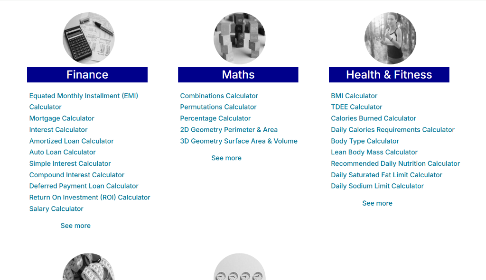

<div align="center">

# Calculator21

**35 free online calculators for finance, math, health and unit conversion, built with plain HTML, CSS and JavaScript**

**[Live demo](https://ian-joseph.netlify.app/calculator21/index.html)** · [Portfolio](https://ian-joseph.netlify.app/)




</div>

## About

Calculator21 is a multi-page calculator website: loans and mortgages, interest and investments, geometry, nutrition and fitness, unit conversions and everyday date and time maths. Every calculator runs entirely in the browser with no framework, library or build step, and each page is written to be found through search.

## Features

| Category | Calculators |
| --- | --- |
| **Finance** (10) | EMI, mortgage, interest, amortized loan, auto loan, simple interest, compound interest, deferred payment loan, return on investment (ROI), salary |
| **Math** (5) | combinations, permutations, percentage, 2D geometry (perimeter and area), 3D geometry (surface area and volume) |
| **Health & fitness** (9) | BMI, TDEE, calories burned, daily calorie needs, body type, lean body mass, recommended daily nutrition, saturated fat limit, sodium limit |
| **Unit conversion** (6) | distance, weight, area, volume, temperature, time |
| **Other** (5) | time difference, days between dates, age, time spent, grade and GPA |

- **Payment schedules**: the loan and mortgage calculators break the result down into monthly and yearly tables of principal, interest and balance.
- **Metric and imperial units** where it matters, such as BMI and body measurements.
- **Responsive layout** for phones, tablets and desktops.

## Tech stack

| Area | Technologies |
| --- | --- |
| Pages | Semantic HTML5, one page per calculator |
| Styling | CSS3 with CSS Grid and media queries, a shared layout stylesheet plus one per page |
| Logic | Vanilla JavaScript (about 4,400 lines), no dependencies |
| Analytics | Google Analytics 4 |

## Technical highlights

- **No dependencies.** No framework, library or bundler: each page loads only its own small script, so pages are light and there is nothing to install or build.
- **Amortization schedules computed in the browser.** Six finance calculators (EMI, mortgage, interest, amortized loan, auto loan and deferred payment loan) generate full monthly and yearly repayment tables with DOM APIs.
- **Search-friendly by design.** Every calculator has its own URL and meta description (44 of 44 pages), all listed in `sitemap.xml` and a browsable sitemap page.
- **Consistent layout from shared styles.** Two skeleton stylesheets define the header, sidebar navigation and footer for every page; per-page stylesheets only add what is specific to each calculator.

## Getting started

It's a static site, so any web server works:

```bash
git clone https://github.com/ianjhh/calculator21.git
cd calculator21
npx serve .              # or: python -m http.server 8000
```

You can also open `index.html` directly in a browser.

## Project structure

```
calculator21/
├── *.html          # one page per calculator, kept at the root so URLs don't change
├── assets/
│   ├── css/        # style_<page>.css, plus shared layouts in style_skeleton_*.css
│   ├── js/         # script_<page>.js
│   ├── images/     # category and illustration images
│   ├── icons/      # favicon, logo and navigation icons
│   └── fonts/
├── docs/
│   ├── images/     # README screenshot
│   └── notes/      # development notes
└── sitemap.xml
```

## Author

Built by [@ianjhh](https://github.com/ianjhh) · [Portfolio](https://ian-joseph.netlify.app/)
